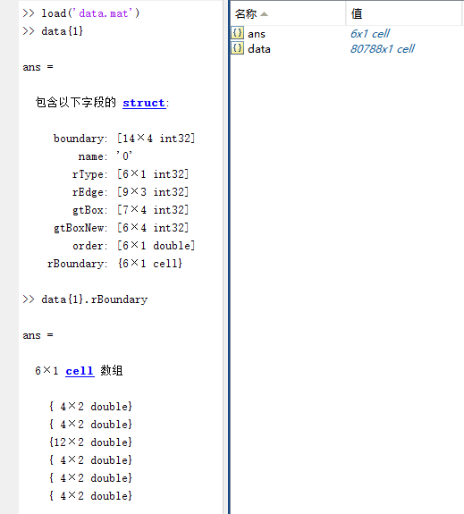
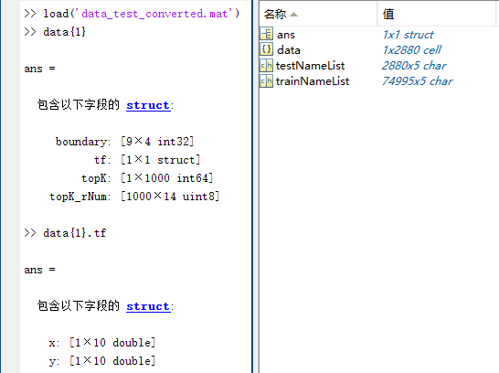

**1. Data from RPLAN to Graph2Plan**

Please refer to https://github.com/zzilch/RPLAN-Toolbox.
You can also download the extracted data from [here](http://vcc.tech/file/upload_file/Data/G2P/Data.7z).
You can load the `Network/data/data.mat` in Matlab to chek the data structure.



Data fields:

- name: file name in RPLAN
- boundary: (x,y,dir,isNew)
    - first two point indicate the front door.
    - dir: 0(right)/1(down)/2(left)/3(up) for `dir`. 
    - `isNew` means the point is not a corner point (usually a point of door)
- order: room order, the larger one will cover the smaller one.
- rType: room categories
```
# index,name,type(private/public),floorTexture
room_label = [
    (0, 'LivingRoom', 1, "PublicArea"),
    (1, 'MasterRoom', 0, "Bedroom"),
    (2, 'Kitchen', 1, "FunctionArea"),
    (3, 'Bathroom', 0, "FunctionArea"),
    (4, 'DiningRoom', 1, "FunctionArea"),
    (5, 'ChildRoom', 0, "Bedroom"),
    (6, 'StudyRoom', 0, "Bedroom"),
    (7, 'SecondRoom', 0, "Bedroom"),
    (8, 'GuestRoom', 0, "Bedroom"),
    (9, 'Balcony', 1, "PublicArea"),
    (10, 'Entrance', 1, "PublicArea"),
    (11, 'Storage', 0, "PublicArea"),
    (12, 'Wall-in', 0, "PublicArea"),
    (13, 'External', 0, "External"),
    (14, 'ExteriorWall', 0, "ExteriorWall"),
    (15, 'FrontDoor', 0, "FrontDoor"),
    (16, 'InteriorWall', 0, "InteriorWall"),
    (17, 'InteriorDoor', 0, "InteriorDoor")
]
```
- rBoundary: (x,y), boundary points for each room
- gtBox: (y0,x0,y1,x1), min-max bounds of a room [RPLAN]
- gtBoxNew: (x0,y0,x1,y1), min-max bounds of a room [Graph2Plan]
- rEdge: (u,v,r), room indices and relative position(u relative to v)
```
edge_type = [
    'left-above',
    'left-below',
    'left-of',
    'above',
    'inside',
    'surrounding',
    'below',
    'right-of',
    'right-above',
    'right-below'
]
```

**2. Data from Network to GUI**

We provide scripts to create the same data as we provided in Interface. Like DeepLayout, we use 75k for training and about 3k for validation and test.
Started from the `Network/data/data.mat`:

0. Change the data path to the `data.mat` in `config.py`
1. Run `1.tf_train.py`. It will create:
    - `trainTF.pkl`, `testTF.pkl`: Piecewise turning function. Each element is a dict like `{'x':[x0,...,xn],'y':[y0,...,yn]}`
    - `tf_train.npy`: Sampled turning function with shape (ntrain,1000)
    - `D_test_train.npy`: Truning function distance matrix with shape (ntest,ntrain)
2. Run `2.data_train_converted.py`. It will create:
    - `data_train_converted.mat` & `data_train_converted.pkl`: The `.pkl` one Just a copy of the `.mat` re-dumped with pickle. The data have similar structure with `data.mat`. 
    - box:(x0,y0,x1,y1,room type)
    
3. Run `3.rNum_train.py`. It wil create:
    - `rNum_train.npy`: counts of different room type 
4. Run `4.data_train_eNum.py`. It will create:
    - `data_train_eNum.pkl`: A dict like {'eNum':Array with shape (ntrain,25)}. Each array is reshape from (5,5) which means adjacency matrix of 5 coarse room types.
5. Run `5.data_test_converted.py`. It will create:
    - `data_train_converted.mat` & `data_train_converted.pkl`: The `.pkl` one Just a copy of the `.mat` re-dumped with pickle. 
    

    Data fileds:
        - boundary: (x,y,dir,isNew)
        - tf: Piece with turning function
        - topK: 1000 indices of the training data has the minimun turning function with current data.
        - topK_rNum: Counts for differnt room type of each topK room
6. **[Depends on [faiss](https://github.com/facebookresearch/faiss)]** Run `6.cluster.py`.  It will create:
    - `centroids_train.npy`: 1000 discrete turning function cluster centroids (1000-d) of training data
    - `clusters_train.npy`: 1000 nearest neighbors in training data of each centroid