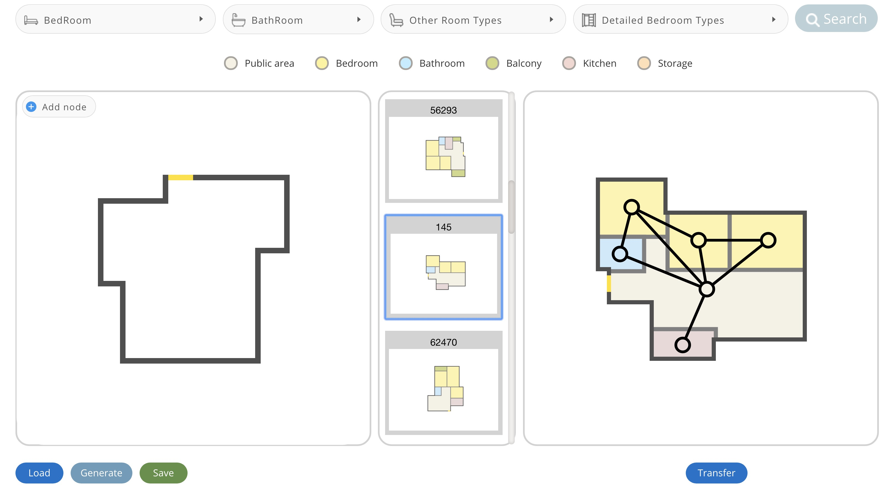
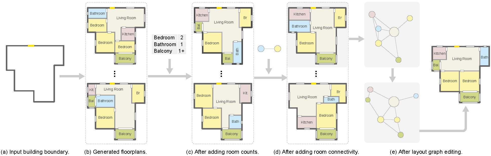

# Graph2plan
An interactive interface, where the user can edit the retrieved graph and adapt it as needed. The user can add or delete room nodes and/or adjacency edges, or move nodes around to change the layout.



#### Graph2Plan: Learning Floorplan Generation from Layout Graphs
[project page](https://vcc.tech/research/2020/Graph2Plan) | [video & demo](https://vcc.tech/file/upload_file//image/research/att202005081043/Graph2Plan.mp4)   

[Ruizhen Hu](http://csse.szu.edu.cn/staff/ruizhenhu/), Zeyu Huang, Yuhan Tang, [Oliver Van kaick](http://people.scs.carleton.ca/~olivervankaick/index.html), [Hao Zhang](http://www.cs.sfu.ca/~haoz/), [Hui Huang](http://vcc.szu.edu.cn/index-2.html)

SIGGRAPH 2020

We introduce a learning framework for automated floorplan generation which combines generative modeling using deep neural networks and userin- the-loop designs to enable human users to provide sparse design constraints. Such constraints are represented by a layout graph. The core component of our learning framework is a deep neural network, Graph2Plan, which converts a layout graph, along with a building boundary, into a floorplan that fulfills both the layout and boundary constraints. Given an input building boundary, we allow a user to specify room counts and other layout constraints, which are used to retrieve a set of floorplans, with their associated layout graphs, from a database. For each retrieved layout graph, along with the input boundary, Graph2Plan first generates a corresponding raster floorplan image, and then a refined set of boxes representing the rooms. Graph2Plan is trained on RPLAN, a large-scale dataset consisting of 80K annotated floorplans. The network is mainly based on convolutional processing over both the layout graph, via a graph neural network (GNN), and the input building boundary, as well as the raster floorplan images, via conventional image convolution. We demonstrate the quality and versatility of our floorplan generation framework in terms of its ability to cater to different user inputs.We conduct both qualitative and quantitative evaluations, ablation studies, and comparisons with state-of-the-art approaches.




#### Contact
If you have any questions or find any bugs, please contact us: Ruizhen Hu(ruizhen.hu@gmail.com), Zeyu Huang(vcchzy@gmail.com), Yuhan Tang(yuhantang55@gmail.com)

# 1. Interface
### Installation
This implementation requires the following dependencies (tested on Window 10):

* Conda

* Python 3.7 

  ```bash
  conda create -n g2p_app python=3.9 # python=3.7
  conda activate g2p_app
	```

* You can quickly install/update these dependencies by running the following:

  ```bash
  #  (old)
  #  conda install django opencv scipy pandas shapely
  #  conda install pytorch==1.3.1 torchvision -c pytorch
  
  # change the url acchording to your CUDA version, refer to: https://pytorch.org/
  pip install torch torchvision torchaudio --index-url https://download.pytorch.org/whl/cu117 -U
  pip install django opencv-python scipy pandas shapely -U
  ``` 
  **Note: there is a fatal error when using Matlab and pytorch<1.5.0 together on Linux. Please install the latest pytorch 1.5.0+ to use the interface and run post processing.**
		
* Matlab Python API (Matlab 2019a+ for python 3.7):
  Find the file "setup.py" in `<PATH_TO_MATLAB>/<VERSION>/extern/engines/python/` and run
  
  ```
  python setup.py install
	```


###  Run

* Process Data: Download RPLAN from [here](http://staff.ustc.edu.cn/~fuxm/projects/DeepLayout/index.html) and processe them using the [toolbox](https://github.com/zzilch/RPLAN-Toolbox) and scripts in `DataPreparation`. We provide pre-processed data here just for convenient to reproduce the result in our paper: https://github.com/HanHan55/Graph2plan/releases/download/data/Data.zip

	unzip the data to this repository
	
	The upload boundary in the interface is under the folder Interface\static\Data\Img\
	
	**Note: Place the unzipped data in a folder with the same file name as the project code.**
* Run project:

  ```bash
  python manage.py runserver 0.0.0.0:8000
  ```
		
* Open browser: http://127.0.0.1:8000/home
			
	

# 2. Network & Post Processing
## 2.1. Network
### Requirements

Create a new environment for training.

  ```bash
  conda create -n g2p_train python=3.9 #python=3.7
  conda activate g2p_train
  #  (old)
  #  conda install django opencv scipy pandas
  #  conda install pytorch==1.3.1 torchvision==0.4.2 -c pytorch
  
  # change the url acchording to your CUDA version, refer to: https://pytorch.org/
  pip install torch torchvision torchaudio --index-url https://download.pytorch.org/whl/cu117 -U
  pip install django opencv-python scipy pandas shapely tqdm tensorboardX pytorch-ignite==0.2.1 -U
  ```

### Prepare data

**Data format**

  After getting the data introduced in the **Interface** part, you can find a compact dataset in `Network/data.mat`. It is extracted from [RPLAN](http://staff.ustc.edu.cn/~fuxm/projects/DeepLayout/index.html) using the [toolbox](https://github.com/zzilch/RPLAN-Toolbox).
  It can be read by Matlab via `load('data.mat','data')` or python via

  ```python
  import scipy.io as sio
  data = sio.loadmat('data.mat', squeeze_me=True, struct_as_record=False)['data']
  print(len(data)) # a data list
  ```

  Each one of the data item has following fields

  ```
  data_item
      - name: file name in RPLAN dataset
      - boundary: (x,y,dir,isNew), first two point indicate the front door
      - order: room order for visualization
      - rType: room categories
      - rBoundary: (x,y), boundary points for each room
      - gtBox: (y0,x0,y1,x1), left-top(in) and right-bottom(out) corner of a room, extracted directly from the RPLAN dataset
      - gtBoxNew: (x0,y0,x1,y1), extracted after filling the gap between rooms
      - rEdge: (u,v,r), room indices and relative position(u relative to v)
  ```

**Split data for training**

  Run the split script to get train/valid/test split of the data in `Network/data`

  ```bash
  python split.py
  ```

More details in DataPreparation folder.

### Train

  Run the trainning script and the experiment logs and outputs are saved in `experiment` (created automatically).

  ```bash
  # train + valid
  python train.py
  # testing evaluation
  python train.py --skip_train 1 
  ```

## 2.2. Post processing & Generate without Interface
The final output of the network is a raster floorplan image and one bounding box for each room (the refined one). An issue that may occur with the output boxes is that they may not be well-aligned and some boxes may overlap in certain regions. So we need some post processing.

### Requirements
The requirements of post processing are the same with the **Interface** part. **Matlab** is required to align room bounding boxes with the floorplan boundary.

### Test with network training data

Change the `model_path` to the path of trained model and `dataset_path` to the test split of the dataset in `PostProcessing/test.py`, and run 

```
python test.py
```
A floorplan image `test.png` will be generated.  

### Test with boundary images

Get the data introduced in the **Interface** part (`Interface\static\Data\Img\`), and run

```
python test_interface_data.py
```
A floorplan image `test_interface_data.png` will be generated.  


### Acknowledgement

Some source files are borrowed from:
- sg2im: https://github.com/google/sg2im
- scene generation: https://github.com/ashual/scene_generation

Original RPLAN dataset: http://staff.ustc.edu.cn/~fuxm/projects/DeepLayout/index.html
